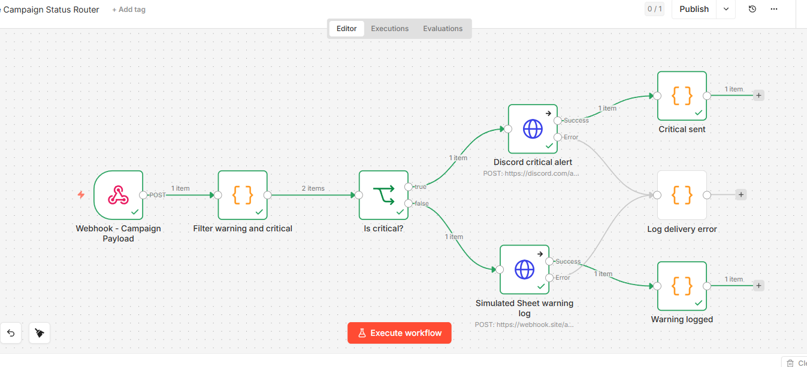
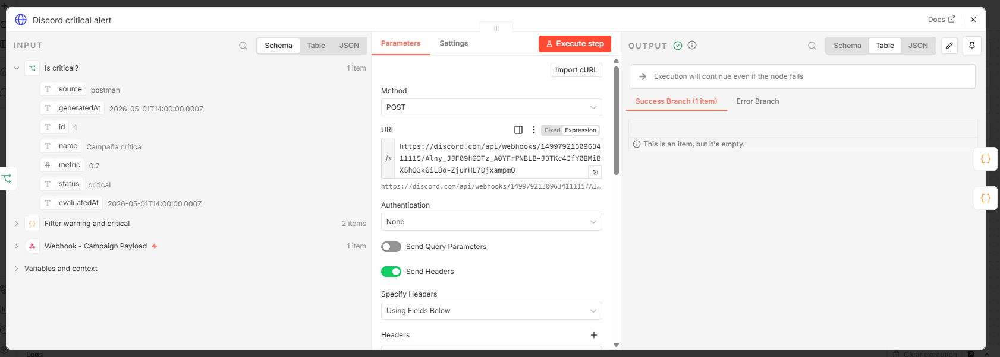
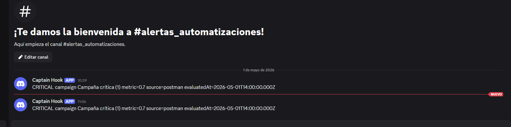
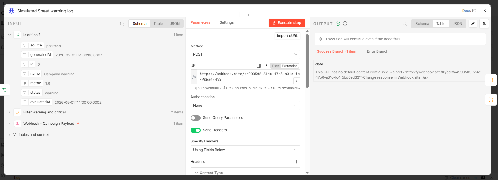
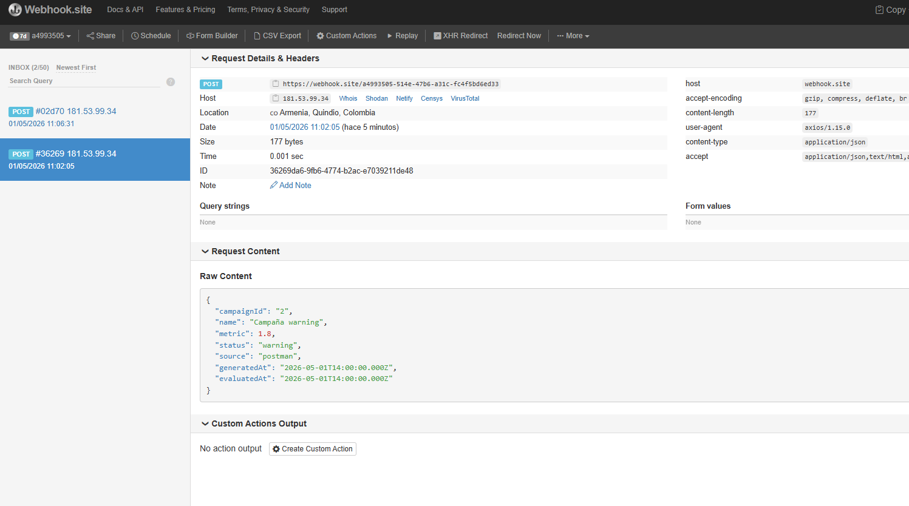
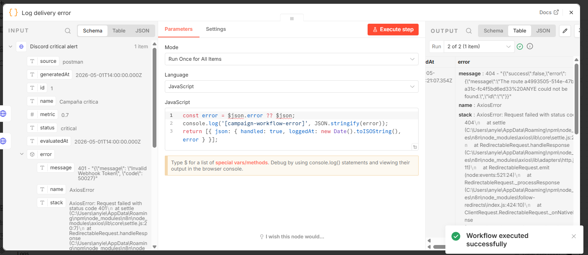
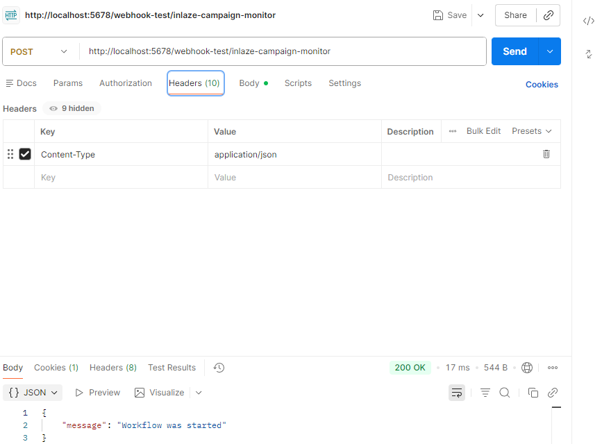

# Inlaze - Monitor de Campañas

Script en TypeScript/Node.js que consume una API REST pública, transforma la respuesta en
reportes tipados de campaña, aplica reglas de umbral y persiste el resultado en JSON local
para alimentar las Partes 2, 3 y 4 de la prueba técnica.

## Stack

- **Node.js 20+** (usa `fetch` nativo, sin dependencia de `axios`)
- **TypeScript** en modo estricto (`strict`, `noUncheckedIndexedAccess`, `exactOptionalPropertyTypes`)
- **Zod** para validación runtime de respuestas externas y variables de entorno
- **Vitest** para pruebas unitarias
- **dotenv** para carga de configuración

## Cómo correr

```bash
# 1. Instalar dependencias
npm install

# 2. Copiar el archivo de variables de entorno
cp .env.example .env

# 3. Ejecutar en modo desarrollo (tsx, sin compilación)
npm run dev

# 4. O compilar y ejecutar
npm run build
npm start

# 5. Tests
npm test
```

El resultado se guarda en `./data/campaigns.json` (configurable vía `OUTPUT_PATH`).

## Decisiones de diseño

### ¿Por qué DummyJSON?

Se eligió [DummyJSON `/products`](https://dummyjson.com/products) como simulación de
fuente de datos de campañas porque:

1. **Pública y sin autenticación** — facilita correrlo en cualquier entorno sin secretos.
2. **Estructura estable y documentada** — soporta `?limit=N` y `?skip=N` (paginación).
3. **Tiene un campo numérico continuo (`rating`, 0–5)** que se mapea naturalmente a una
   métrica de campaña (ej. ROAS o un CTR escalado). El rango 0–5 cubre los tres estados
   `ok / warning / critical` con los umbrales por defecto sin manipulación adicional.
4. **El campo `title` sirve como nombre humano** y `id` como identificador único.

Alternativas evaluadas: JSONPlaceholder (carece de campo numérico continuo), REST Countries
(rangos numéricos no permiten cubrir los tres estados sin distorsión).

### ¿Por qué esos umbrales?

Los umbrales (`warning < 2.5`, `critical < 1.0`, `ok ≥ 2.5`) se respetan **tal cual** los
define el enunciado. La razón conceptual de mantenerlos:

- **Tres bandas con un solo número** — separar `ok / warning / critical` con dos cortes
  permite ruteo binario en N8N (Parte 2): `critical → Slack`, `warning → Sheet`, `ok →
  ignorar`. Más bandas complicarían el flujo sin aportar señal.
- **`critical < 1.0` como "campaña en pérdida"** — si la métrica simula ROAS, un valor
  por debajo de 1.0 significa que se gasta más de lo que se ingresa: alerta inmediata.
- **`warning < 2.5` como "rendimiento subóptimo"** — banda intermedia para registrar
  sin alertar a un canal de tiempo real.

**Decisiones de implementación:**

1. Los umbrales se leen de `.env` (`THRESHOLD_WARNING`, `THRESHOLD_CRITICAL`) → se
   ajustan por entorno sin recompilar.
2. Se valida en [src/config/env.ts](src/config/env.ts) que `THRESHOLD_CRITICAL <
   THRESHOLD_WARNING` al arrancar; si no, el proceso falla rápido.
3. La lógica vive en [src/domain/threshold-policy.ts](src/domain/threshold-policy.ts) como
   función pura (`classifyMetric`), sin I/O → cubierta con tests de fronteras.
4. Si en el futuro hace falta otra política (ej. distinta por operador o por tipo de
   campaña), se reemplaza la función por una `IThresholdPolicy` sin tocar el caso de uso.

### Arquitectura (Hexagonal ligera)

```
src/
├── domain/                     # Reglas y tipos puros, sin I/O
│   ├── campaign-report.ts      # CampaignReport, CampaignStatus, RawCampaign
│   ├── threshold-policy.ts     # classifyMetric() — pura, testeable
│   └── errors.ts               # NetworkError, TimeoutError, ValidationError, etc.
├── infrastructure/
│   ├── http/
│   │   ├── http-client.ts      # fetch + timeout + retry + clasificación de errores
│   │   └── retry.ts            # Backoff exponencial con jitter, genérico
│   ├── datasources/
│   │   ├── campaign-data-source.ts   # ICampaignDataSource (puerto)
│   │   └── dummyjson-data-source.ts  # adaptador concreto + validación Zod
│   ├── storage/
│   │   ├── campaign-repository.ts    # ICampaignRepository (puerto)
│   │   └── json-file-repository.ts   # escritura atómica (write-then-rename)
│   └── logger.ts               # logger JSON estructurado mínimo
├── application/
│   └── evaluate-campaigns.ts   # caso de uso: orquesta fetch → mapear → evaluar → persistir
├── config/env.ts               # carga + validación de variables de entorno con Zod
└── index.ts                    # composition root (DI manual)
```

#### Extensibilidad: agregar otra fuente de datos

Crear una clase que implemente `ICampaignDataSource`:

```ts
export class GoogleAdsDataSource implements ICampaignDataSource {
  readonly name = 'google-ads';
  async fetchCampaigns(): Promise<RawCampaign[]> { /* ... */ }
}
```

…y reemplazarla en `src/index.ts`. **El núcleo (caso de uso, dominio, repositorio) no cambia.**
Lo mismo aplica para cambiar de almacenamiento JSON a SQLite/Postgres: nueva implementación
de `ICampaignRepository`.

### Manejo de errores

Errores tipados (`src/domain/errors.ts`) con jerarquía clara:

| Error                  | Causa                                    | Reintentable |
|------------------------|------------------------------------------|--------------|
| `TimeoutError`         | `AbortController` dispara antes de respuesta | sí       |
| `NetworkError`         | DNS, TCP, body no-JSON                   | sí           |
| `HttpStatusError`      | 4xx/5xx                                  | solo 408/425/429/5xx |
| `ValidationError`      | Respuesta no cumple el schema Zod        | no           |
| `RetryExhaustedError`  | Se agotaron los intentos                 | terminal     |

El `HttpClient` clasifica el error y delega a `withRetry()`, que aplica **backoff exponencial
con jitter** (`baseDelay * 2^(attempt-1)`, capado en `maxDelayMs`). Sólo se reintentan
errores transitorios — un 400 o un payload inválido falla inmediatamente sin desperdiciar
intentos.

### Validación runtime con Zod

TypeScript desaparece en runtime, así que validar la respuesta de la API con Zod (no sólo
asumir el tipo) es lo que cumple el criterio de "respuestas inesperadas". Si DummyJSON
cambia el contrato, se rompe en el borde con un `ValidationError` explícito en lugar de
propagar `undefined` por todo el sistema.

### Escritura atómica de JSON

`JsonFileRepository` escribe primero a `<archivo>.tmp` y luego hace `rename`. Si el proceso
muere a la mitad, el archivo de salida queda intacto (no se corrompe el input de la Parte 2).

### Antipatrones evitados

- **Sin `any`**: `unknown` + Zod en los bordes externos.
- **Sin try/catch tragones**: cada `catch` reclasifica a un error de dominio o relanza.
- **Sin singletons globales**: dependencias inyectadas por constructor (testables sin mocks intrusivos).
- **Lógica de negocio sin I/O**: `classifyMetric` es pura → se prueba sin red ni FS.
- **Reloj inyectable** (`clock`) en el caso de uso: tests deterministas para `evaluatedAt`.
- **Reintentos selectivos**: no se reintentan errores 4xx no transitorios ni `ValidationError`.

## Salida (formato)

```json
{
  "source": "dummyjson",
  "generatedAt": "2026-05-01T10:00:00.000Z",
  "count": 30,
  "reports": [
    {
      "id": "1",
      "name": "Essence Mascara Lash Princess",
      "metric": 4.94,
      "status": "ok",
      "evaluatedAt": "2026-05-01T10:00:00.000Z"
    }
  ]
}
```

Este JSON es exactamente el payload que la Parte 2 (flujo N8N) recibirá vía webhook.

## Parte 2 - Flujo N8N

El flujo exportado esta en [workflows/n8n-campaign-router.json](workflows/n8n-campaign-router.json)

- `Webhook - Campaign Payload`: recibe por HTTP POST el payload generado en la Parte 1.
- `Filtar entre warning y critical`: descarta campañas `ok` y conserva solo `warning` o `critical`.
- `Is critical?`: bifurca el camino.

- `Discord critical alert`: envia las campañas `critical` a un webhook Discord/Slack. usa tu url de discor en este caso dejaré las mias ; si no existe o da un error este va a Log delivery error para simular.

- `Simulación Sheet warning log`: registra las campañas `warning` por HTTP. Usamos https://webhook.site para hacer una recepción ficticia tomado https://webhook.site/numero_id; si no existe o da un error este va a Log delivery error para simular.

- `Log delivery error`: captura errores de los nodos HTTP y los loguea sin cortar toda la ejecucion.

### Probar conexion Parte 1 -> N8N

1. Importar `workflows/n8n-campaign-router.json` en N8N.
2. Copiar la URL de test o produccion del nodo `Webhook - Campaign Payload`.


```bash
N8N_WEBHOOK_URL=http://localhost:5678/webhook-test/inlaze-campaign-monitor
```

3. Ejecutar:

```bash
npm run dev
```

El script guarda `data/campaigns.json` y, si `N8N_WEBHOOK_URL` existe, envia ese mismo
payload al webhook.

## Parte 3 - Extension de codigo y base de datos

### 3A — Problemas identificados en el codigo original

El fragmento entregado funciona solo en el caso feliz. Se identificaron 4 problemas:

**1. Sin validacion de respuesta**
`response.data` es `any` en axios. Si `clicks` o `impressions` llegan como `string` o `null`, el CTR se calcula sobre datos corruptos sin ningun aviso.
Correccion: validacion con Zod (`RemoteCampaignSchema`) antes de operar sobre los datos.

**2. Division por cero**
`clicks / impressions` sin proteger `impressions === 0` produce `Infinity` o `NaN` silenciosamente.
Correccion: `calculateCtr()` detecta el caso y lanza `ValidationError` con mensaje explicito.

**3. Loop secuencial**
El `for...of` con `await` dentro procesa una campana a la vez. Con 100 IDs el tiempo es 100x la latencia individual.
Correccion: `processCampaigns` delega en `mapConcurrent` con tope de 3 peticiones simultaneas.

**4. Array sin tipo**
`const results = []` se infiere como `any[]`; el contrato de salida queda implicito y TypeScript no protege nada.
Correccion: tipo explicito `CampaignCtrResult` en todo el flujo, sin ningun `any`.

La funcion `findLowCtrCampaigns()` fue agregada sobre el codigo refactorizado: retorna solo las campanas con `ctr < 0.02`, ordenadas de menor a mayor CTR.

La utilidad `mapConcurrent` se extrajo a [src/infrastructure/concurrency/map-concurrent.ts](src/infrastructure/concurrency/map-concurrent.ts) por ser generica — no depende del dominio y puede reutilizarse en cualquier flujo concurrente del proyecto.

### 3B — Query con Prisma Client

Archivo: [src/application/find-worst-roas-campaigns.ts](src/application/find-worst-roas-campaigns.ts)

Usa la API de Prisma en lugar de SQL crudo, con tipos propios que replican el subconjunto necesario del cliente generado (evita acoplarse a `@prisma/client` directamente en el dominio):

1. `campaignMetric.groupBy()` agrupa por `campaignId`, filtra `recordedAt >= now - N dias`, calcula `_avg.roas` y devuelve **ordenado por ROAS asc** desde la BD.
2. Se filtran en memoria los registros con `_avg.roas === null` (campanas sin datos).
3. `campaign.findMany()` trae nombre y operador de las campanas resultantes.
4. Se agrupa en memoria por operador aprovechando que Prisma ya devuelve ordenado — se acumula con `push` directo (O(n)) en lugar de re-ordenar en cada iteracion (O(n log n)).
5. Los operadores se ordenan de menor a mayor ROAS del peor de sus campanas.

Tipo de retorno:

```ts
type WorstRoasCampaignsByOperator = {
  operator: { id: string; name: string };
  campaigns: readonly WorstRoasCampaign[];  // ordenados peor ROAS primero
};
```

## Tests

```bash
npm test
```

Cubre:

- `process-campaign-performance` - diagnostico/refactor 3A, CTR bajo y concurrencia maxima
- `find-worst-roas-campaigns` - query tipada 3B con agrupacion por operador y orden por ROAS

- `threshold-policy` — clasificación, fronteras, validación de input
- `retry` — éxito, reintentos, backoff exponencial, errores no reintentables
- `evaluate-campaigns` — caso de uso end-to-end con dobles de prueba
- `dummyjson-data-source` — mapeo correcto y rechazo de payloads inválidos
